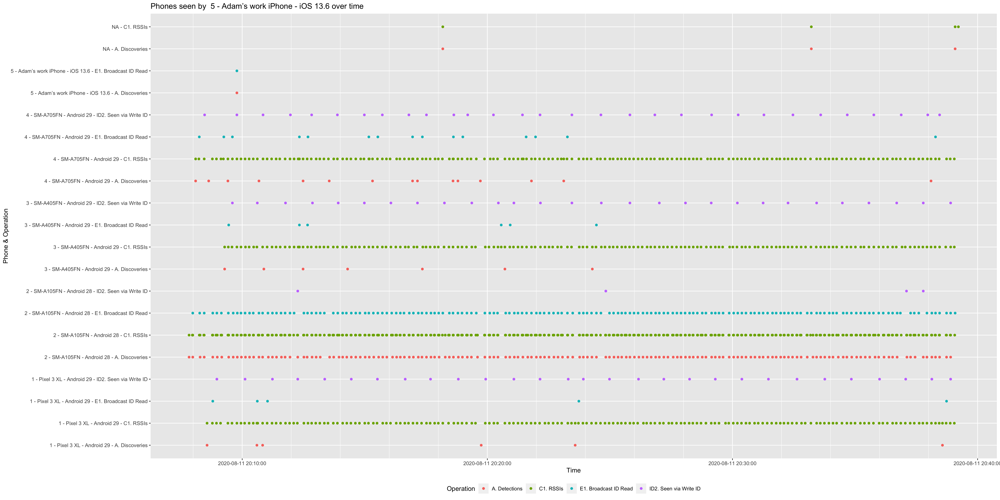

# Herald Analysis repository

This repository contains data analysis and research from the Herald
project. It currently consists of the following:-

- Fair Efficacy Formula Analysis Scripts - To measure the efficacy of any Digital Contact Tracing application
- RSSI readings at distance - aimed to aid research in to RSSI to distance conversion algorithms. Includes code for RSSI reading automation robots.
- Phone self-calibration research - to allow phones to calibrate to their environment and how they are stored about a person, allowing comparable risk scoring algorithms to be ran over this data.

## License & Copyright

Copyright 2020-2022 Herald Project Contributors

See LICENSE.txt and NOTICE.txt for details.

## Phone self calibration Scripts

There is a source-able R library called heraldrisk.R that provides
a set of functions allowing data generated by the Herald Demo App
to be analysed. 

This works by correcting for TxPower and filtering real interactions over a period of time (2.5 days should be sufficient) and then
spotting peaks in corrected data to infer 'close/personal space' and 'near/acquiantance space' using Proxemics, and calibrating
a proximity scale to those human behavioural zones.

Once the data is calibrated, risk algorithms can use this standard
proximity scale to perform their calculations on.

Using two different phones on test subjects that live together and have very different jobs and working hours showed that calibrating on all other bluetooth contact events, then applying each phones own calibration results to their mutual contact events, gave very similar risk scores - to within 7.5% of each other.

There are several files in this group:-
- heraldrisk.R - re-usable R functions for Herald risk scoring
- SelfCalibration.R - used to show how to perform self calibration on a phone
- SelfCalibrationCheck.R - used to load phone self calibration data, and perform mutual phone to phone risk analysis for mutual contacts (i.e. used to validate the results of SelfCalibration.R)
- SelfCalibrationLinking.R - used to match two contact phones where their internal clocks recorded different times due to system failure

## Fair Efficacy Formula Analysis Scripts

R analysis scripts for the Fair Efficacy Formula for proximity detection protocols in contact tracing apps

### How to use

1. Download and install the protocol test application on two or more
phones.
1. Pick one of the suggested formal tests
1. After running the desired test download the test results CSV folders
1. Place this in a folder named after the phone from the test

Now run the test run analysis script:-

1. Open TestAnalysis.R in RStudio
1. Edit the folder name to be the folder above your phone name subfolders
1. Edit the start and end times to be 10 minutes before and after your test
1. Edit the Contact Event (CE) start and end times to be the time the phones were ALL in contact with each other (i.e. the time the last phone was brought in to the room, and just before the time you turned bluetooth off on the first phone)
1. Select all lines
1. Run the script

This script should be ran for every test

### The output

You will see an accuracy graph and a report graph generated for each phone.

- Report graph - shows communication between that phone and all other phones. If all goes well you should see solid lines (as dots join each other)
- Accuracy graph - shows the RSSI received for each phone during the test. Each phone is colour coded. Expect lots of spurious values, but each colour phone should mostly be the same RSSI value if kept at a constant distance during the test

An example report is shown below:-

You also get three summary statistics CSV files:-

- summary-discovery-pairs.csv - Shows a true/false grid for each phone pairing for detection only
- formal-summary.csv - Shows all detection, continuity, and longevity stats as per the Fair Efficacy Formula
- formal-continuity.csv - Shows detection and continuity stats per phone pairing

These too are in the sample-output folder.

### Accuracy testing

Accuracy testing works differently. Use the Bluetooth Calibration app to generate data for each phone pairing of interest at all the indicated distances on that app. Then open the FormalAccuracy.R file, read the instructions, and run the script.

This will generate a formal accuracy analysis CSV file, whose data is also used in the fair efficacy formula.

You only need run this script for a representative sample of phone pairs once to generate your accuracy data.

## RSSI readings at distance

Please see the [RSSI Reference Data README](reference-data/rssi-raw-edison/README.md)
for details.

## Assistance

Please report [issues here](https://github.com/theheraldproject/herald-analysis/issues) and email oss-coc@vmware.com with any code of conduct open source issues.
