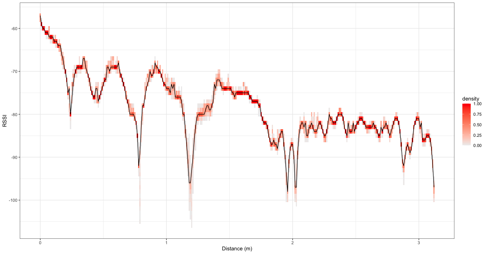
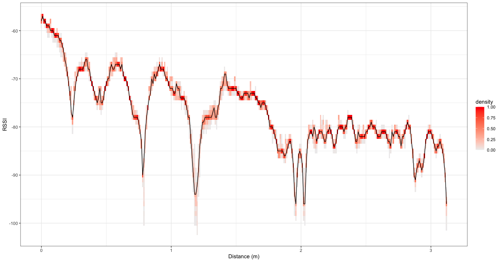
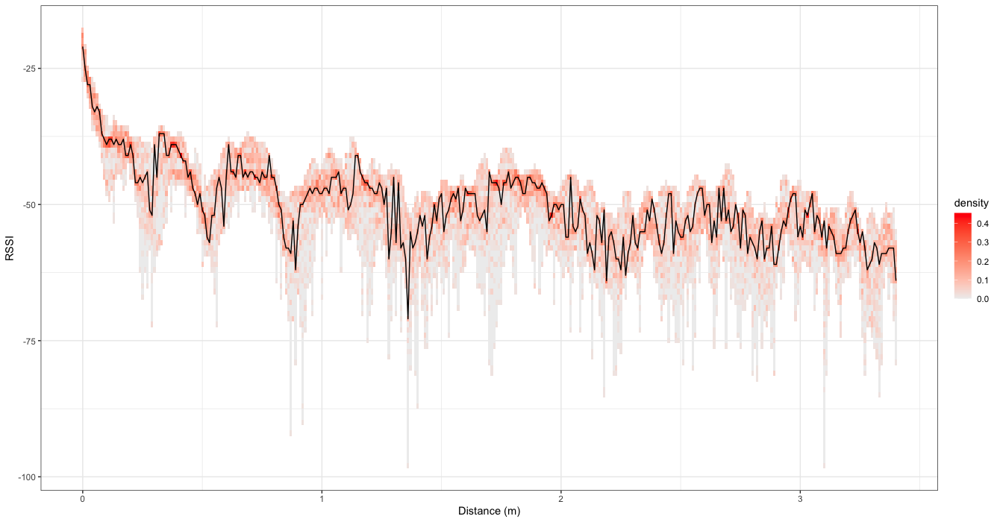
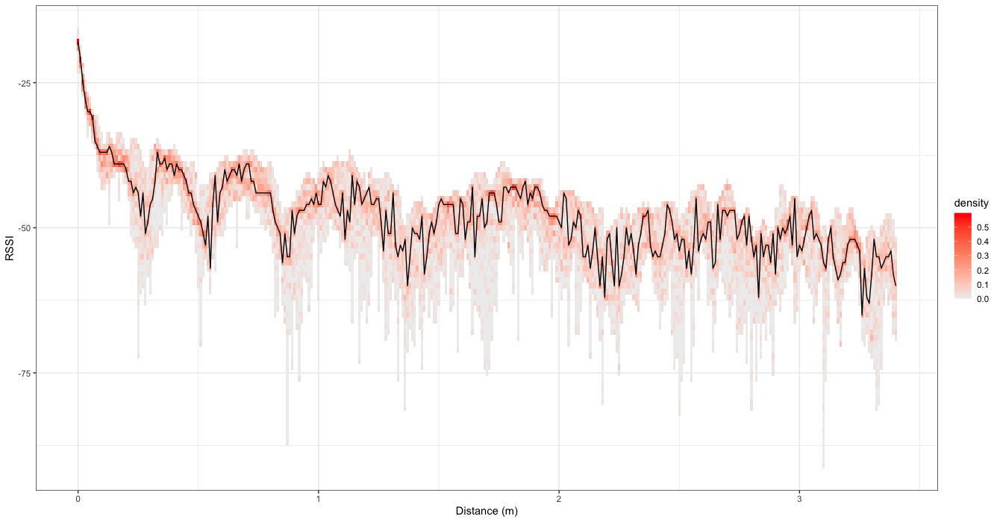
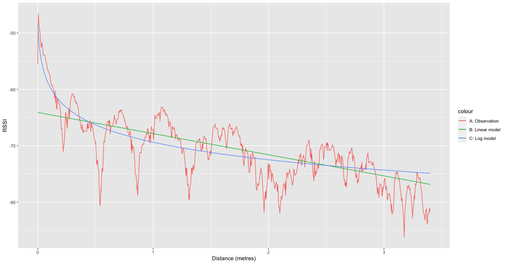
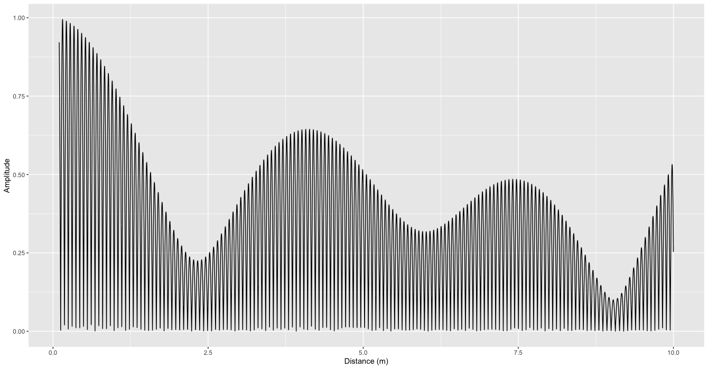
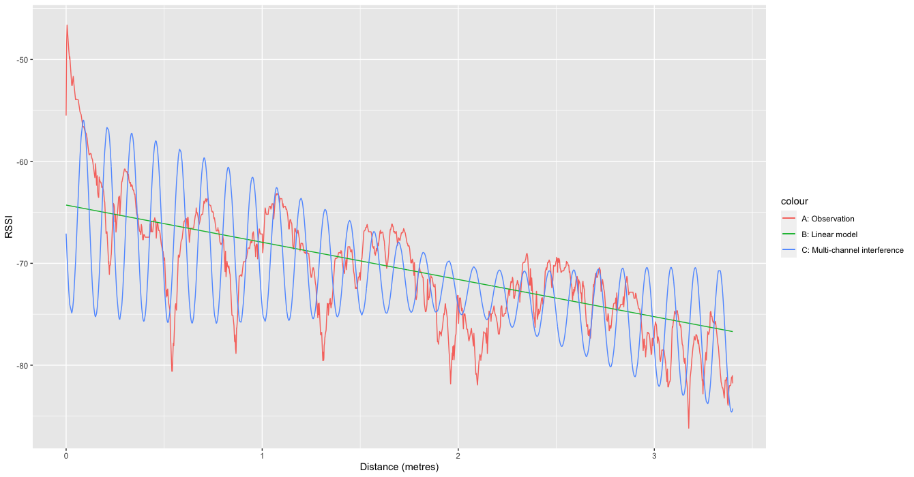
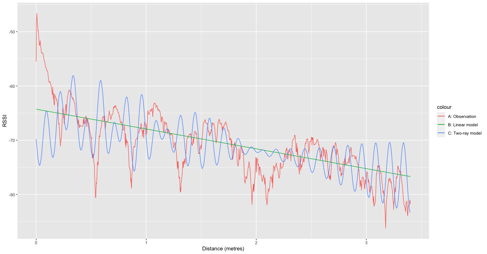
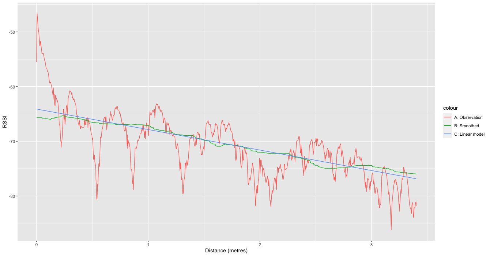

# Calibration data : RSSI to distance

Bluetooth low energy (BLE) received signal strength indicator (RSSI) offer an estimator of physical proximity, where RSSI values decrease with increasing physical distance. The accurate conversion from RSSI to distance is an active area of research, as the process requires data modelling and calibration (Lovett et al., 2020), and radio signal is subject to interference (Leith and Farrell, 2020).

Reference data for RSSI values taken at different physical distances using different devices is fundamental for research. The manual production of this data is prohibitively time consuming and labour intensive. The aim of this work is to automate the process to make this data freely available to support research, using simple and widely available components to facilitate community participation and replication.

Download all available reference data [here](Archive.zip) (1.6 million measurements).

## Method

### Test environment

The automated process uses two phones running the HERALD demonstration app. The phones are set to capture RSSI continuously in the background, like a real app. The inertia sensor is enabled in HERALD to log significant movements  (i.e. when the phone is moved to a new position) to provide timestamps for separating RSSI measurements captured at different distances. One of the phones remain static, while the other is moved by a fixed distance at regular intervals to generate the reference data set. Manual post-processing is then applied to partition the data into time periods at different distances, using the inertia sensor data for guidance.

The test environment uses a cable car and pulley system driven by an [Edison robot](https://meetedison.com) to move the phone by a fixed distance (e.g. 20 cm) at regular intervals (e.g. every 30 minutes) to cover the entire measurement range (e.g. 0 to 300 cm), and then rewinding the phone back to its starting position ready for the next test. This simple setup is easy to replicate at minimal cost. The Edison robot EdPy code for this automated process is available [here](edison.py).

### Test procedure

1. Program Edison robot.
   1. Edit EdPy code to define sampling duration, distance and steps (optional).
   2. Follow EdPy development environment instructions to load program onto Edison robot.
2. Select and prepare the two phones for data capture (same as standard HERALD test procedure).
   1. Airplane mode ON, Bluetooth OFF, uninstall existing HERALD demonstration app, reboot and fully charge phones.
   2. Set **inertiaSensorEnabled = true** in demonstration app (see **BLESensorConfiguration**).
   3. Install and start HERALD demonstration app on both phones, select **Personal Phone** demonstration mode.
   4. Grant Location (always allow) and Bluetooth permissions, then move app to background (return to home screen).
   5. Airplane mode OFF, Bluetooth ON, then lock screen, to start data capture in background mode.
3. Place phones in cable cars.
   1. Ensure cable cars are at starting position, i.e. B is next to A.
   2. Insert Phone A into cable car A, and Phone B into cable car B, paying attention to the phone orientation.
4. Run test.
   1. Conduct visual checks to ensure cable cars are in position, and pulley system is in working order.
   2. Start Edison robot, wait for audio signal to ensure test has started.
   3. Wait for test to complete, cable car B should be back next to cable car A at end of test.
   4. Power off Edison robot.
   5. Remove phones from cable cars, Airplane mode ON, Bluetooth OFF.
5. Download phone logs.
   1. Create new folder based on test time stamp (e.g. `20210102`).
   2. Create subfolder for phone A and B with the prefixed "A" and "B" (e.g. `20210102/A-Denmark`, `20210102/B-P2`).
   3. Copy phone logs to respective subfolders, i.e. each subfolder should contain a file `calibration.csv`.
6. Generate reference data set.
   1. Run the calibration log segmentation tool (see `CalibrationLogSegmentation` class in [Eclipse Java Project](java/segmentation)).
      Usage : `CalibrationLogSegmentation [logFolder] [DurationInMinutes] [DistanceInCm] [Steps]`
      Example : `CalibrationLogSegmentation 20210102 20 10 30`
   2. Conduct visual quality check to ensure the segments are of expected length and RSSI values change with distance.

### Phones

The phones used for data capture are as follows. Location permission was granted for all phones in all tests.

| Name        | Model               | OS         | Notes                                         |
| ----------- | ------------------- | ---------- | --------------------------------------------- |
| 4S          | Apple iPhone 4S     | iOS 9.3.5  | Battery drains unusually fast due to age      |
| Germany     | Apple iPhone 5S     | iOS 12.3   | Battery drains unusually fast due to age      |
| Denmark     | Apple iPhone 6S     | iOS 12.1.4 | Battery drains unusually fast due to age      |
| Netherlands | Apple iPhone 6 Plus | iOS 12.4.9 |                                               |
| 6S+         | Apple iPhone 6S Plus | iOS 13.6  |                                               |
| 8+          | Apple iPhone 8 Plus | iOS 13.6   |                                               |
| X           | Apple iPhone X      | iOS 14.2   |                                               |
| P2          | Google Pixel 2      | Android 29 | Battery drains unusually fast due to age, TxPower = -16 |
| P3          | Google Pixel 3      | Android 30 | Operating System is Android 12 Developer Preview, TxPower = -16 |
| J6          | Samsung J6          | Android 28 | BLE advertising and accelerometer unsupported |
| A10         | Samsung A10         | Android 28 | BLE address rotates every few seconds, TxPower = -15 |
| A20         | Samsung A20         | Android 29 | BLE address rotates every few seconds, TxPower = -15 |
| N8          | Samsung Note 8      | Android 28 | BLE address rotates every few seconds, TxPower = -15 |
| S9+         | Samsung S9+         | Android 29 | BLE address rotates every few seconds, TxPower = -15 |

## Reference data

The following tests were conducted with both phones in a vertical position on its side, aligned to the cable axis, as shown in the images above. **Range** is the range of distances covered by the dataset. **Step** is the distance travelled per movement, i.e. phone is moved by 10cm every 30 minutes. **Duration** is the sampling duration at each position, e.g. 30 minutes at 10cm. Individual download links provide the reference data captured by phone A and/or B.

Future work will automate data capture and publish data for phones in different orientations.

A zipped bundle of all available data can be downloaded [here](Archive.zip).

| Date     | Phone A | Phone B | Range (cm) | Step (cm) | Duration (mins) | Download                                          |
| -------- | ------- | ------- | ---------- | --------- | --------------- | ------------------------------------------------- |
| 20200101 | Denmark | P2      | 0 - 200    | 20        | 30              | [B](20210101-1938-B.csv)                          |
| 20200102 | Denmark | P2      | 0 - 200    | 20        | 30              | [B](20210102-1128-B.csv)                          |
| 20200102 | Denmark | P2      | 0 - 200    | 20        | 30              | [B](20210102-1800-B.csv)                          |
| 20200103 | J6      | A20     | 0 - 200    | 20        | 30              | [A](20210103-1026-A.csv) [B](20210103-1026-B.csv) |
| 20200104 | P2      | A20     | 0 - 300    | 25        | 30              | [A](20210104-1422-A.csv) [B](20210104-1422-B.csv) |
| 20210105 | A10     | A20     | 0 - 300    | 25        | 30              | [A](20210105-1754-A.csv) [B](20210105-1754-B.csv) |
| 20210106 | N8      | P2      | 0 - 300    | 25        | 30              | [A](20210106-0815-A.csv) [B](20210106-0815-B.csv) |
| 20210106 | N8      | P2      | 0 - 300    | 20        | 30              | [A](20210106-1501-A.csv) [B](20210106-1501-B.csv)     |
| 20210106 | N8      | P2      | 0 - 300    | 20        | 30              | [A](20210106-2251-A.csv) [B](20210106-2251-B.csv)     |
| 20210107 | A10     | A20     | 0 - 300    | 10        | 20              | [A](20210107-1123-A.csv) [B](20210107-1123-B.csv) |
| 20210107 | Denmark     | P2     | 0 - 300    | 10        | 20              | [A](20210107-2245-A.csv) [B](20210107-2245-B.csv) |
| 20210108 | Denmark | Germany | 0 - 300 | 10 | 20 | [A](20210108-1423-A.csv) [B](20210108-1423-B.csv) |
| 20210109 | Denmark | Germany | 0 - 300 | 10 | 20 | [A](20210109-2342-A.csv) [B](20210109-2342-B.csv) |
| 20210110 | A20 | P2 | 0 - 300 | 10 | 20 | [A](20210110-2247-A.csv) [B](20210110-2247-B.csv) |
| 20210111 | Netherlands | Germany | 0 - 300 | 10 | 20 | [A](20210111-1015-A.csv) [B](20210111-1015-B.csv) |
| 20210111 | A10 | A20 | 0 - 300 | 10 | 20 | [A](20210111-2252-A.csv) [B](20210111-2252-B.csv) |
| 20210112 | P2 | A10 | 0 - 300 | 10 | 20 | [A](20210112-2303-A.csv) [B](20210112-2303-B.csv) |
| 20210113 | Netherlands | Denmark | 0 - 300 | 10 | 20 | [A](20210113-2034-A.csv) [B](20210113-2034-B.csv) |
| 20210305 | Netherlands | Denmark | 0 - 150 | 1 | 10 | [A](20210305-0958-A.csv) [B](20210305-0958-B.csv) |
| 20210306 | Netherlands | Denmark | 100 - 250 | 1 | 10 | [A](20210306-1803-A.csv) [B](20210306-1803-B.csv) |
| 20210308 | Netherlands | Denmark | 200 - 350 | 1 | 10 | [A](20210308-0922-A.csv) [B](20210308-0922-B.csv) |
| 20210309 | Netherlands | Denmark | 0 - 320 | 1 | 5 | [A](20210309-1437-A.csv) [B](20210309-1437-B.csv) |
| 20210311 | P2 | A20 | 0 - 340 | 1 | 4 | [A](20210311-0901-A.csv) [B](20210311-0901-B.csv) |
| 20210312 | P2 | P3 | 0 - 340 | 1 | 4 | [A](20210312-1049-A.csv) [B](20210312-1049-B.csv) |
| 20210313 | 6S+ | 8+ | 0 - 340 | 1 | 4 | [A](20210313-1005-A.csv) [B](20210313-1005-B.csv) |
| 20210314 | Netherlands | P3 | 0 - 340 | 1 | 4 | [A](20210314-1021-A.csv) [B](20210314-1021-B.csv) |
| 20210315 | S9+ | P2 | 0 - 340 | 1 | 4 | [A](20210315-1040-A.csv) [B](20210315-1040-B.csv) |

Release notes:

**20210109** - Test environment updated to raise altitude of cable car, and increase maximum range supported by the environment. This test was conducted in a noisy environment with three other HERALD instances running at the same time (five in total) and at least five other Bluetooth devices active.

**20210110** - All tests from 20210109 shall use the new test environment, and running just the two HERALD instances for data capture.

**20210305** - All tests from 20210305 shall use an enhanced segmentation algorithm that synchronises time across two devices based on initial detection timestamps. Improving timing accuracy means only +/- 30 seconds of data around segmentation boundary is discarded (instead of +/- 60 seconds) to avoid inclusion of data during movement.  

## Analysis

### Observation

Experiment data captured at 1cm resolution covering 0.0 - 3.4m (20210311 to 20210315) has revealed a recurring undulating pattern where RSSI values change significantly with small movements, and at reasonably predictable intervals. The following two charts show the distribution of RSSI values captured by two Android phones on 20210312, along with the mode value at each 1cm (black line).

*RSSI captured by Pixel 2 (phone A) on 20210312*

*RSSI captured by Pixel 3 (phone B) on 20210312*

The results show a consistent undulating pattern across the two phones, albeit with slightly different RSSI values at times. Significant changes were observed at specific positions. For example, RSSI is -70 at 0.63m, but drops to -92 at 0.78m, and back up to -70 at 0.87m, thus RSSI changed by 22 units in the space of 15cm and 9cm respectively. Considering circa 200 samples were taken at each 1cm, and the distribution of RSSI values around the mode is limited, the observation suggests the pattern is not random and merits investigation.

The following two charts show the data captured by two iOS phones on 20210313. A similar undulating pattern was observed, although the absolute measurements and distribution are different from the previous experiment. The same pattern was observed in all other experiments (20210311, 20210314, and 20210315).

*RSSI captured by iPhone 6S+ (phone A) on 20210312*

*RSSI captured by iPhone 8+ (phone B) on 20210312*

All experiment data were combined using dynamic time warping to align the time series by distance based on normalised RSSI values (rank of RSSI, which is scale invariant). This is necessary because the measurements were taken according to distance between the outer casing of the phones, while the exact location of the transmitting and receiving antennae within the phones are unknown. Furthermore, the test environment is imperfect, thus the 1cm steps cannot be exact. The following chart shows the combined data.

The results show the undulating pattern is common across all experiment data. The oscillation varies in magnitude and period, resembling some kind of wave interference and multi-path signal fading models.

### Investigation

A series of investigations were conducted to understand the observations, which previously were assumed to be random interferences and measurement errors when data was captured at a lower resolution (e.g. 10 - 20cm). The investigations identified three key contributors to the observed pattern: (a) path loss, (b) multi-channel interference, and (c) reflections.

#### Path loss
Overall trend in the reduction of signal strength over distance is typically modelled using the Friis transmission formula which is based on logarithmic trend. The following chart presents observed data, along with fitted linear and log models.

The results show the log model is a reasonable fit for 0 - 0.4m range, but the linear model is a better fit for the overall trend from 0.2m, especially beyond 2m. Given the main motivation for accurate distance estimation is to enable risk estimation in contact tracing, where the distance range of interest is >= 0.5m, the linear model offers a simple path loss model that opens up opportunities for on-device optimisation and self-calibration over time. For example, using average encounter patterns based on typical user behaviour, and distribution of all RSSI measurements for device specific calibration to avoid reliance on transmit power in calibrating distance estimation.

#### Multi-channel
BLE adverts are broadcasted on three channels: channel 37 at 2.402 GHz, channel 38 at 2.426 GHz, and channel 39 at 2.480 GHz. Transmitting three signals at different frequencies simultaneously from a common source means constructive and destructive interferences shall be common place even for the line-of-sight signal. A simulation was conducted to assess the potential impact (see [R script](r/MultiChannelModel.R) for details). The following chart presents the simulation output.

The results show interferences between the three channels have significant impact across the entire distance range of interest (0 - 8m), especially within the 0 - 4m range, where the local minima and maxima at around 2.4m and 4m can change by 50%. The following chart presents observed data, along with fitted linear model combined with multi-channel interference.

The results show multi-channel interference contributes towards the undulating pattern, especially for the dip around 2m followed by unusually large variance around 3m.

#### Reflections
Multi-path propagation causes constructive and destructive interference, where reflected signals at different phases combine to increase or decrease received signal strength. The impact can be estimated by a simple two-ray ground-reflection model, or a fading model (e.g. Rayleigh, Rician) depending on the context and environment. The following chart presents the observed data, along with fitted linear model, and two-ray model combined with multi-channel interference.

The results show interferences between the three channels and reflected signal contribute towards the undulating pattern with variable magnitude and period. The combined effect is particularly marked in the 0 - 1.5m range, then multi-channel interference play a more dominant role from 1.5m onwards. This is inline with expectations for the two-ray model, where the contribution of reflected signals become less prominent with distance.

### Solution

Absolute distance estimation based on RSSI measurements remains an unsolved problem. Test results have shown the same RSSI value is observed at different distances. For example, RSSI is -70 at 0.22m, 0.83m, 1.63m, and 2.47m. However, test results have also shown variation of RSSI values at a fixed distance is minimal, thus the challenge is discovering the complex relationship between RSSI and distance, as opposed to RSSI being a fundamentally unreliable distance estimator.

Investigations and simulations have shown the undulating pattern stems from a combination of physical (path loss, multi-channel) and environmental (reflections) factors. Reflections shall differ in every environment, thus it is impractical to model and counter the impact. Multi-channel is more predictable but is expected to change over time as the three channels drift in phase, thus creating different interference patterns over distance. Path loss has typically been modelled using a logarithmic function, but test results have shown a linear model will suffice for the distance range of interest.

While the impact of multi-channel and reflections cannot be accurately modelled for all environments, the fact that interference causes RSSI to vary over short distances can be exploited to improve distance estimation accuracy in real applications. For contact tracing, the phones are expected to be carried on person, either in pocket or bag, to estimate proximity between people. Under these circumstances, it is unlikely for both phones to be perfectly stationary for long periods, because the slightest movement including just breathing is sufficient to move the phone by a few centimetres. Given the phones are constantly moving, a smoothing function can be applied to reduce the impact of interference over distance. Several smoothing filters were assessed, and the most generally applicable solution was the median over sliding window filter, where the median value of raw RSSI samples from the previous and next 30 seconds (i.e. one minute sliding window) is used as a reliable measurement for distance estimation. The following chart presents the observed data, along with fitted linear model, and smoothed data.

The results show the smoothing function is effective in reducing the impact of interference on RSSI measurements over distance. Deviation of smoothed data from the fitted linear model is minimal, thus suggesting the approach is effective if the phones are constantly moving, which holds true for the intended application. If both phones are perfectly static (e.g. in typical lab tests, or the phones are both placed on a desk) the approach will fail.

A remaining problem now is scaling the RSSI values for each phone. While the phones all follow the same observed pattern, test results have shown the exact RSSI values differ between phones due to differing transmit power, antennae, casing, and implementation. As such, the linear equation for translating RSSI to distance needs to be scaled accordingly for accurate distance estimation. Previous works have used phone model and transmit power as indicators for calibrating and adjusting the measured values. This is impractical given the wide range of phones on the market, and also subtle differences in manufacturing for phones of the same model. Future work will focus on self-calibration using the distribution of all RSSI values captured by a phone over time, and assumptions about typical human behaviour, e.g. unlikely to be within 0.2m for long periods. It is anticipated that self-calibration should be feasible for the intercept and coefficient parameters.

### Conclusion

Based on the test results, a combination of smoothing over distance and a linear model offers a reasonable estimator of physical distance based on RSSI measurements. The ability to capture many RSSI samples at frequent intervals is fundamental to the approach as minor changes to distance can have a dramatic impact on RSSI values. This observation is exploited by frequent sampling to capture the changes in the undulating pattern, thus the median value over time (and therefore distance) offers a reliable basis for distance estimation. Test results and simulations suggest a sliding window of one minute offers a good balance for effective smoothing while capturing genuine movements. Specifically, the median is taken from a sliding window covering the previous and next 30 seconds. Linear regression across all available data suggests the following parameters for the linear model.

$DistanceInMetres = -17.1021 + -0.2668 \times MedianRssi$

It is anticipated that the generic intercept (-17.1021) and coefficient (-0.2668) parameters shall require adaptation for each phone for best accuracy. Future work shall investigate self-calibration for adjusting these parameters.

## References

Harald T. Friis (1946) "A Note on a Simple Transmission Formula". Proceedings of the I.R.E. and Waves and Electrons, pp 254–256.

Douglas J. Leith and Stephen Farrell (2020) "Measurement-Based Evaluation Of Google/Apple Exposure Notification API For Proximity Detection in a Commuter Bus". [arXiv:2006.08543](https://arxiv.org/abs/2006.08543)

Tom Lovett, Mark Briers, Marcos Charalambides, Radka Jersakova, James Lomax and Chris Holme (2020) "Inferring proximity from Bluetooth Low Energy RSSI with Unscented Kalman Smoothers". [arXiv:2007.05057](https://arxiv.org/abs/2007.05057)
