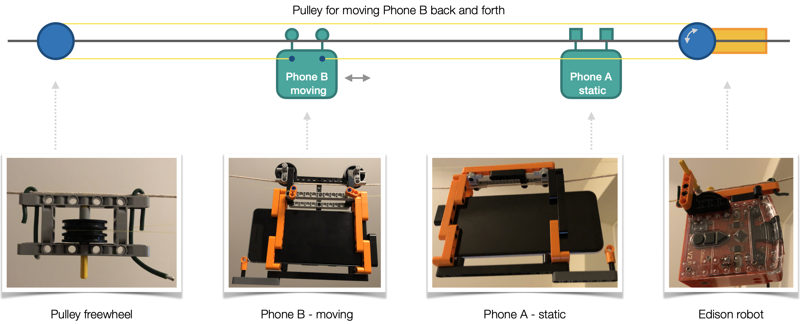

# Calibration data : RSSI to distance 

Bluetooth low energy (BLE) received signal strength indicator (RSSI) offer an estimator of physical proximity, where RSSI values decrease with increasing physical distance. The accurate conversion from RSSI to distance is an active area of research, as the process requires data modelling and calibration (Lovett et al., 2020), and radio signal is subject to interference (Leith and Farrell, 2020).

Reference data for RSSI values taken at different physical distances using different devices is fundamental for research. The manual production of this data is prohibitively time consuming and labour intensive. The aim of this work is to automate the process to make this data freely available to support research, using simple and widely available components to facilitate community participation and replication.

Download all available reference data [here](Archive.zip) (1.3 million measurements).

## Method

### Test environment

The automated process uses two phones running the HERALD demonstration app. The phones are set to capture RSSI continuously in the background, like a real app. The inertia sensor is enabled in HERALD to log significant movements  (i.e. when the phone is moved to a new position) to provide timestamps for separating RSSI measurements captured at different distances. One of the phones remain static, while the other is moved by a fixed distance at regular intervals to generate the reference data set. Manual post-processing is then applied to partition the data into time periods at different distances, using the inertia sensor data for guidance.

The test environment uses a cable car and pulley system driven by an [Edison robot](https://meetedison.com) to move the phone by a fixed distance (e.g. 20 cm) at regular intervals (e.g. every 30 minutes) to cover the entire measurement range (e.g. 0 to 300 cm), and then rewinding the phone back to its starting position ready for the next test. This simple setup is easy to replicate at minimal cost. The Edison robot EdPy code for this automated process is available [here](edison.py).

### Test procedure

1. Program Edison robot.
   1. Edit EdPy code to define sampling duration, distance and steps (optional).
   2. Follow EdPy development environment instructions to load program onto Edison robot.
2. Select and prepare the two phones for data capture (same as standard HERALD test procedure).
   1. Airplane mode ON, Bluetooth OFF, uninstall existing HERALD demonstration app, reboot and fully charge phones.
   2. Set **inertiaSensorEnabled = true** in demonstration app (see **BLESensorConfiguration**).
   3. Install and start HERALD demonstration app on both phones, select **Personal Phone** demonstration mode.
   4. Grant Location (always allow) and Bluetooth permissions, then move app to background (return to home screen).
   5. Airplane mode OFF, Bluetooth ON, then lock screen, to start data capture in background mode.
3. Place phones in cable cars.
   1. Ensure cable cars are at starting position, i.e. B is next to A.
   2. Insert Phone A into cable car A, and Phone B into cable car B, paying attention to the phone orientation.
4. Run test.
   1. Conduct visual checks to ensure cable cars are in position, and pulley system is in working order.
   2. Start Edison robot, wait for audio signal to ensure test has started.
   3. Wait for test to complete, cable car B should be back next to cable car A at end of test.
   4. Power off Edison robot.
   5. Remove phones from cable cars, Airplane mode ON, Bluetooth OFF.
5. Download phone logs.
   1. Create new folder based on test time stamp (e.g. `20210102`).
   2. Create subfolder for phone A and B with the prefixed "A" and "B" (e.g. `20210102/A-Denmark`, `20210102/B-P2`).
   3. Copy phone logs to respective subfolders, i.e. each subfolder should contain a file `calibration.csv`.
6. Generate reference data set.
   1. Run the calibration log segmentation tool (see `CalibrationLogSegmentation` class in [Eclipse Java Project](java/segmentation)).
      Usage : `CalibrationLogSegmentation [logFolder] [DurationInMinutes] [DistanceInCm] [Steps]`
      Example : `CalibrationLogSegmentation 20210102 20 10 30`
   2. Conduct visual quality check to ensure the segments are of expected length and RSSI values change with distance.

### Phones

The phones used for data capture are as follows. Location permission was granted for all phones in all tests.

| Name        | Model               | OS         | Notes                                         |
| ----------- | ------------------- | ---------- | --------------------------------------------- |
| 4S          | Apple iPhone 4S     | iOS 9.3.5  | Battery drains unusually fast due to age      |
| Germany     | Apple iPhone 5S     | iOS 12.3   | Battery drains unusually fast due to age      |
| Denmark     | Apple iPhone 6S     | iOS 12.1.4 |                                               |
| Netherlands | Apple iPhone 6 Plus | iOS 12.4.9 |                                               |
| X           | Apple iPhone X      | iOS 14.2   |                                               |
| P2          | Google Pixel 2      | Android 29 | Battery drains unusually fast due to age      |
| J6          | Samsung J6          | Android 28 | BLE advertising and accelerometer unsupported |
| A10         | Samsung A10         | Android 28 | BLE address rotates every few seconds         |
| A20         | Samsung A20         | Android 29 | BLE address rotates every few seconds         |
| N8          | Samsung Note 8      | Android 28 | BLE address rotates every few seconds         |

## Reference data

The following tests were conducted with both phones in a vertical position on its side, aligned to the cable axis, as shown in the images above. **Range** is the range of distances covered by the dataset. **Step** is the distance travelled per movement, i.e. phone is moved by 10cm every 30 minutes. **Duration** is the sampling duration at each position, e.g. 30 minutes at 10cm. Individual download links provide the reference data captured by phone A and/or B.

Future work will automate data capture and publish data for phones in different orientations.

A zipped bundle of all available data can be downloaded [here](Archive.zip).

| Date     | Phone A | Phone B | Range (cm) | Step (cm) | Duration (mins) | Download                                          |
| -------- | ------- | ------- | ---------- | --------- | --------------- | ------------------------------------------------- |
| 20200101 | Denmark | P2      | 0 - 200    | 20        | 30              | [B](20210101-1938-B.csv)                          |
| 20200102 | Denmark | P2      | 0 - 200    | 20        | 30              | [B](20210102-1128-B.csv)                          |
| 20200102 | Denmark | P2      | 0 - 200    | 20        | 30              | [B](20210102-1800-B.csv)                          |
| 20200103 | J6      | A20     | 0 - 200    | 20        | 30              | [A](20210103-1026-A.csv) [B](20210103-1026-B.csv) |
| 20200104 | P2      | A20     | 0 - 300    | 25        | 30              | [A](20210104-1422-A.csv) [B](20210104-1422-B.csv) |
| 20210105 | A10     | A20     | 0 - 300    | 25        | 30              | [A](20210105-1754-A.csv) [B](20210105-1754-B.csv) |
| 20210106 | N8      | P2      | 0 - 300    | 25        | 30              | [A](20210106-0815-A.csv) [B](20210106-0815-B.csv) |
| 20210106 | N8      | P2      | 0 - 300    | 20        | 30              | [A](20210106-1501-A.csv) [B](20210106-1501-B.csv)     |
| 20210106 | N8      | P2      | 0 - 300    | 20        | 30              | [A](20210106-2251-A.csv) [B](20210106-2251-B.csv)     |
| 20210107 | A10     | A20     | 0 - 300    | 10        | 20              | [A](20210107-1123-A.csv) [B](20210107-1123-B.csv) |
| 20210107 | Denmark     | P2     | 0 - 300    | 10        | 20              | [A](20210107-2245-A.csv) [B](20210107-2245-B.csv) |
| 20210108 | Denmark | Germany | 0 - 300 | 10 | 20 | [A](20210108-1423-A.csv) [B](20210108-1423-B.csv) |
| 20210109 | Denmark | Germany | 0 - 300 | 10 | 20 | [A](20210109-2342-A.csv) [B](20210109-2342-B.csv) |

Release notes:

**20210109** - Test environment updated to raise altitude of cable car, and increase maximum range supported by the environment. Test was conducted in noisy environment with three other HERALD instances running at the same time (five in total) and at least five other Bluetooth devices active. 

## References

Douglas J. Leith and Stephen Farrell (2020) "Measurement-Based Evaluation Of Google/Apple Exposure Notification API For Proximity Detection in a Commuter Bus". [arXiv:2006.08543](https://arxiv.org/abs/2006.08543)

Tom Lovett, Mark Briers, Marcos Charalambides, Radka Jersakova, James Lomax and Chris Holme (2020) "Inferring proximity from Bluetooth Low Energy RSSI with Unscented Kalman Smoothers". [arXiv:2007.05057](https://arxiv.org/abs/2007.05057)